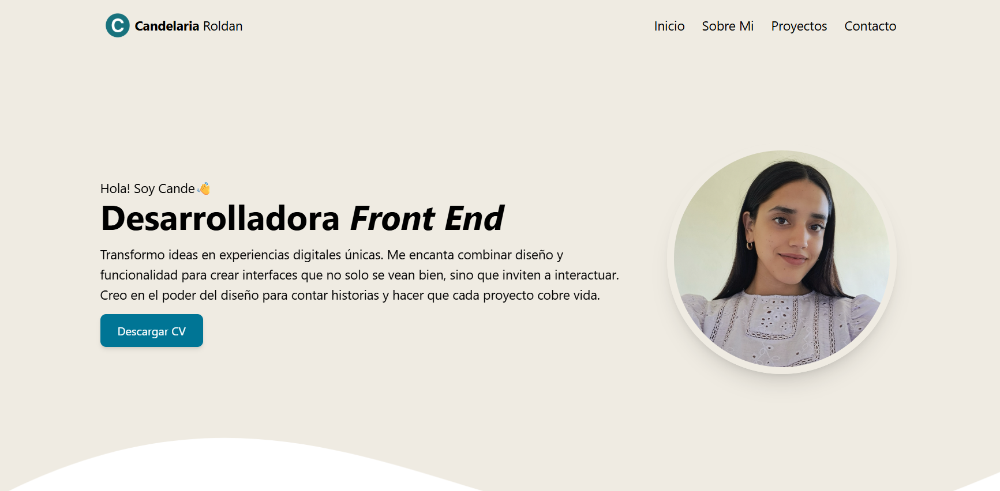

# 🌟 Mi Portfolio Personal – Candelaria Roldan

Este es mi portfolio personal, creado para mostrar mi trayectoria, habilidades, proyectos y experiencia profesional como desarrolladora.  
El objetivo principal es ofrecer una presentación clara y visualmente atractiva de mi perfil, así como facilitar el contacto con potenciales clientes o empleadores.



## 🚀 Tecnologías utilizadas

- **HTML5** – Estructura del sitio.
- **JavaScript (ES6+)** – Interactividad y dinámicas de la página.
- **Tailwind CSS** – Estilos rápidos y personalizables.

## 📂 Secciones del portfolio

1. **Encabezado y Navegación** – Barra fija para acceder fácilmente a todas las secciones.
2. **Presentación personal** – Breve introducción.
3. **Sobre mí** – Intereses y motivación en el desarrollo.
4. **Tecnologías** – Stack de herramientas y lenguajes que domino.
5. **Experiencia profesional** – Puestos, proyectos y logros relevantes.
6. **Proyectos** – Muestras de trabajo con descripciones y enlaces.
7. **Contacto** – Formulario y enlaces a redes profesionales.

## 📦 Instalación y uso

Si deseas clonar y ejecutar el proyecto localmente:

```bash
# Clonar el repositorio
git clone https://github.com/candelariaroldan/portfolio-candelaria-roldan.git

# Entrar a la carpeta del proyecto
cd portfolio-candelaria-roldan

# Abrir el archivo principal en tu navegador
# (por ejemplo, en VS Code con Live Server o simplemente haciendo doble clic en index.html)
